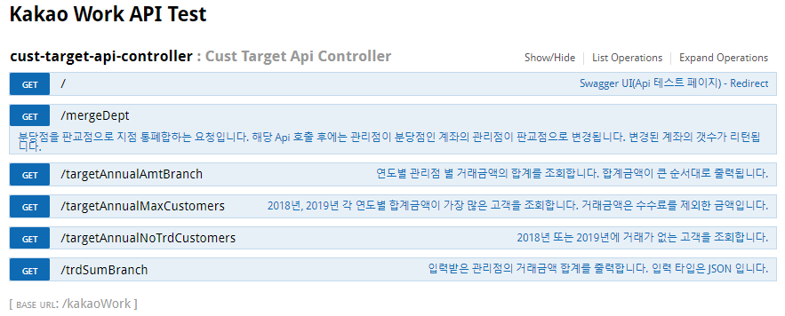
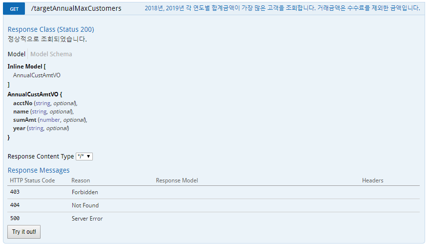
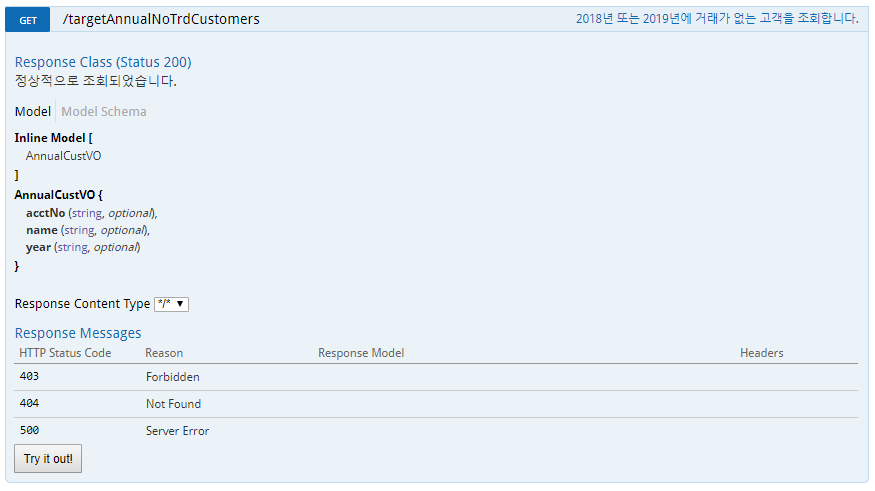
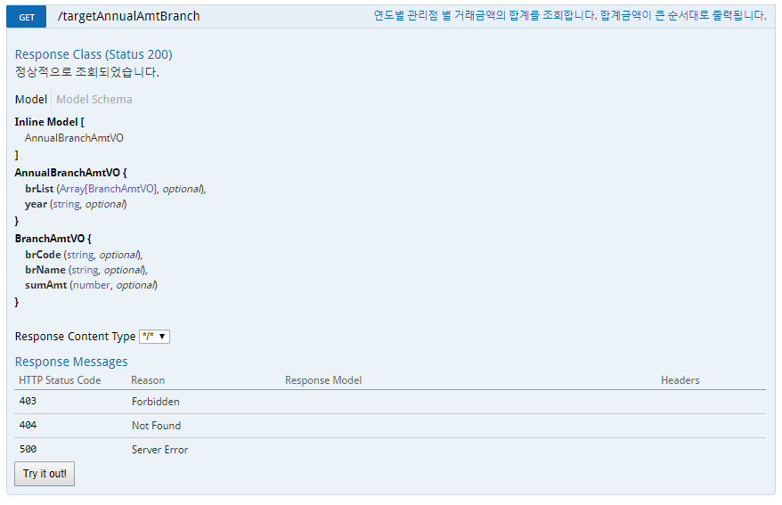
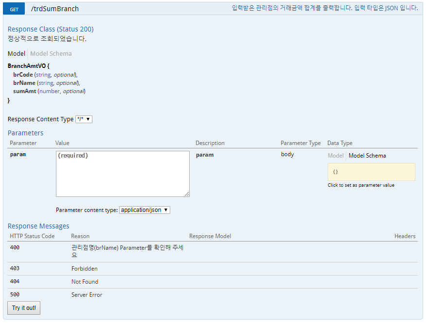
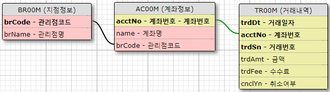

# 지점 마케팅 API 개발
> 특정 고객 거래내역 조회 서비스 개발
* 고객을 타겟팅 하기 위한 지점 마케팅 API를 개발하려 합니다. 데이터에는 거래내역, 고객, 지점정보가 있습니다. 각 데이터를 활용하여 아래 기능명세에 대한 API를 개발하고 각 기능별 Unit Test 코드를 개발하세요. 


## 사용언어 및 개발 환경 
- Java 1.8
- Spring Boot Framework, IntelliJ 
- MySQL, MyBatis 
- Swagger/Swagger-UI (API Docs)


## 빌드 및 실행
- Gradle 빌드 툴 사용
- IntelliJ - Sync Gradle - Run Application 

## dependencies
// 타임리프 및 lombok 플러그인
- 'org.springframework.boot:spring-boot-starter-thymeleaf'
- 'org.projectlombok:lombok'

// mysql, mybatis dependencies
- "org.springframework.boot:spring-boot-starter-jdbc:2.0.1.RELEASE"
- "org.mybatis.spring.boot:mybatis-spring-boot-starter:1.3.1"
- "org.mybatis:mybatis-spring:1.3.1"
- "mysql:mysql-connector-java:5.1.46"
- "org.mybatis:mybatis:3.4.5"

// Swagger dependencies (Api Doc 자동 생성)
- 'io.springfox', name: 'springfox-swagger2', version: '2.5.0'
- 'io.springfox', name: 'springfox-swagger-ui', version: '2.5.0'


## Folder Structure
```
├─main
│  ├─java
│  │  └─com
│  │      └─kakaosecurities
│  │          └─work
│  │              ├─config      // Config Classes
│  │              ├─controller  // Controller  
│  │              ├─dto         // DTO Classes
│  │              ├─exception   // Custom Excpetion
│  │              ├─mapper      // myBatis Mapper Interface
│  │              ├─service     // Service
│  │              └─vo          // VO Classes
│  └─resources
│      ├─mappers        // myBatis mapper xml
│      └─templates      // HomePage html
└─test
    └─java
        └─com
            └─kakaosecurities
                └─work  // Unit Test
```


## 요구사항 명세
*	API 기능명세에서 기술된 API를 모두 개발하세요.
*	Spring boot 기반의 프레임웍을 사용하세요.
*	단위 테스트(Unit Test) 코드를 개발하여 각 기능을 검증하세요.
*	모든 입/출력은 JSON 형태로 주고 받습니다.
*	단, 각 API에 HTTP Method들(GET|POST|PUT|DEL)은 자유롭게 선택하세요.
*	README.md 파일을 추가하여, 개발 프레임웍, 문제해결 방법, 빌드 및 실행 방법을 기술하세요.


## API 명세
- Context-path : "/kakaoWork"
- localhost:8080/kakaoWork/swagger-ui.html  에서 캡처







- mergeDept Api는 지점 통폐합 테스트를 하기 위한 Api (Api Test 요구사항)
- MySQL 설정 후 localhost:8080/kakaoWork/swagger-ui.html 상세 참조
    (DB Schema : kakaosecuritiesdb / id : kakao / password : kakao)


## 문제해결 과정
- 4개의 요청은 입출력이 모두 JSON 이므로 Get 방식의 Rest Api 로 구현.
-  Client - Controller - Service - Mapper(DAO) - DB (MVC 계층 설계 및 구현)
-  모델 설계
> 
- MyBatis Mapper 연동 및 SQL 생성  (/resources/mapper/CustTarget.mapper 참조)
- Service 클래스 구현 (DTO 객체를 받아, VO 객체로 Parsing)
- Controller 클래스 구현 및 Service 객체 연동
- MVC 유닛 테스트 구현을 위한 WebMvtTest 채택 및 각 기능 검증
- 4번 API의 Exception 발생 시, Output Model 변경을 위해 @ControllerAdvice 어노테이션을 사용 및 Custom Exception throw
- 4번 API의 지점 통폐합 Test를 위한 GET Api 제작 (mergeBranch) 
    - Api 호출 시, 관리점이 분당점인 계좌를 판교점으로 UPDATE
- PostMan 툴을 통한 JSON I/O 단위테스트 진행
- Swagger 플러그인을 이용한 Api Docs 제작

